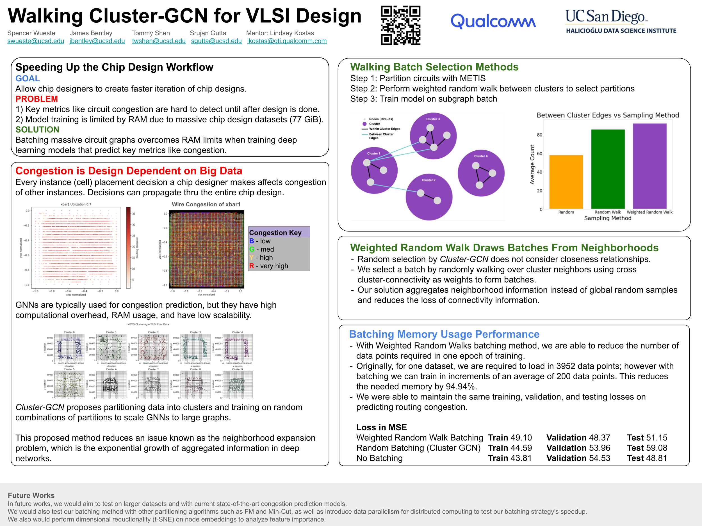

# James's Portfolio
Hi! 👋 I'm James Bentley, a Data Science student at the University of California San Diego with strong interests in Data Science & Machine Learning.
Here are some projects I've completed so far!

## Graph Batching Method for Integrated Circuits

Chips consist of hundreds of millions of logic gates and transistors. Although the chip itself is small in physical size, a graph representation of the chip is very large and produces problems during training due to RAM constraints. Our solution proposes a batching strategy that reduces RAM overhead while maintaining model accuracy on circuit congestion prediction. We use a benchmark batching method proposed by Cluster-GCN, improving upon problems with their random sampling method.

[Website 🌐](https://spencerrazor.github.io/walking-gcn/) • [Report 📖](https://drive.google.com/file/d/1ouMfxmZm9oltgq5J7yZiXt1gXl7XL1-v/view?usp=sharing) • [Code 💻](https://github.com/UCSD-Qualcomm-B07-Group-2/Biased-Batch-Learning-Strategy)

## 3D Reconstruction from Images
- Estimated surface depth map from external light sources with photometric stereo, applying horn integration
technique to accurately predict meshes of human faces.
- Incorporated 8-point algorithm to derive epipolar geometry and match image features, maintaining object point
continuity and preserved perspective.

## Voice AutoTuner and JPEG Compression
- Created autotuner with discrete signal filtering methods to transform sampled audio to clean output signal.
- Developed JPEG image compression algorithm with local and global compression, reducing file size by 90% while
retaining image quality.

## [Large-Scale Data Analysis of Amazon Datasets](https://github.com/jimmybentley/Large-Scale-Amazon-Analysis/tree/main)
### AWS EC2
- Developed distributed computing infrastructure using Dask and AWS EC2, enabling parallel processing of Amazon reviews and products data across multinode cluster.
- Achieved 4x compute speedup and 4x costs saved using distributed computing techniques to optimize data processing and validation algorithms to handle 45 GB of data.
### Apache Spark
- Developed batch processing pipeline using Apache Spark PySQL on Kubernetes cluster.
- Trained decision tree regression model using word embedding with Word2Vec to extract meaningful features from text data and improve recommendation systems.

## Shakepeare Sonnet Generation using LSTM
### Character Level and Word Level RNN
- Trained recurrent neural network with long short-term memory on Shakespearean sonnets for 15 epochs, using cross-entropy loss for optimization.
- Implemented preprocessing techniques such as word tokenization, preserving relevant punctuation and syllable counts.
- Improved model by utilizing word embedding and incorporating syllable count as a feature. Lowered perplexity score and lowered loss in half with word embedding compared to character embedding.
- Generated sonnets resembling Shakespearean style and structure across different temperature settings.

## [Spotify Music Live Data Streaming](https://github.com/jimmybentley/Data-Engineering-Project)
- Enabled real-time cloud data streaming of music listening history for efficient data transfer and processing.
- Set up API integration for secure login with OAuth 2.0 protocols to protect sensitive API information with FastAPI.
- Ensured data consistency and reliability for Kafka producer consumer pipeline with error handling and message flushing, storing sent data in secure S3 bucket.

## [Predicting Ratings of Reviews using Temporal and Sentiment Analysis](https://github.com/JimmyBentley/Prediction-Ratings/blob/main/Ratings_Predictions.pdf)
- Developed a predictive model for rating reviews using Temporal and Sentiment Analysis on Google Local Reviews dataset, with a focus on spam detection
- Extracted time features and conducted sentiment analysis through bag-of-words and TFIDF representations.
- Evaluated various regression models, selecting ridge regression as the top performer with an MSE of 0.915.
- Demonstrated improvement in review quality by identifying discrepancies between text and ratings.
- Highlighted the importance of predicting ratings from review text for spam detection and enhancing user trust in reviews.

## [Quadratic Discriminant Analysis](https://github.com/JimmyBentley/Predictive-ML-with-QDA/blob/main/QDA.ipynb)
- Used probabilistic learning to make predictions on completely unlabeled dataset for class competition.
- Tested on validation set for high sampling distribution accuracy to ensure high accuracy on test set.
- Achieved top 10% of class for highest accuracy.

## [Dimensionality Reduction Techniques](https://github.com/JimmyBentley/Dimensionality-Reduction-Techniques)
- Representing high dimensional data with dimensionality techniques, with Principal Component Analysis (PCA) for linear data and Laplacian Eigenmaps for non-linear data.
- PCA performed on faces dataset which takes a top eigenvector as a detector of eyeglasses.
- Laplacian Eigenmaps performed on k-nearest neighbors graph to find similarity between US universities.

## [Natural Probabilistic Language Models](https://github.com/jimmybentley/Language-Models/tree/main)
- Developed Uniform, Unigram, and N-Gram language models from scratch using probabilistic language modeling techniques and regular expressions.
- Replicated key functions of Python’s NLTK library, utilizing tokenization techniques to preprocess the text for the language models.
- Trained the model to generate text probabilistically based on a tokenized corpus, leveraging probabilistic models to generate text data.
